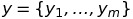
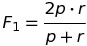
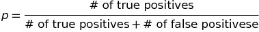
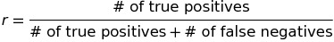

# Machine Learning Engineer Nanodegree
## Capstone Proposal
Juanyan Li  
Janurary 2nd, 2017

## Proposal

### Domain Background

The academic background for this project is **Transfer Learning**. More specifically, according to [1], it is often referred to as **Transductive Transfer Learning**. By definition, it is a machine learning problem where labeled data are only available in the source domain and the task is to predict labels in a target domain. One common setting in the field is assuming the feature spaces across domains (source/target) are the similar (e.g. words that composite the question) but are subject to different marginal distributions. A well-accepted approach to the problem is to re-weight the labeled data in the source domain during training in order to increase the ability of the model to generalize to target domaim. Related topics includes sample selection bias[2] and co-variate shift[3].

[1] Pan, Sinno Jialin, and Qiang Yang. "A survey on transfer learning." IEEE Transactions on knowledge and data engineering 22.10 (2010): 1345-1359.

[2] Zadrozny, Bianca. "Learning and evaluating classifiers under sample selection bias." Proceedings of the twenty-first international conference on Machine learning. ACM, 2004.

[3] Shimodaira, Hidetoshi. "Improving predictive inference under covariate shift by weighting the log-likelihood function." Journal of statistical planning and inference 90.2 (2000): 227-244.

### Problem Statement

The project is chosen from a Kaggle competition: [Transfer Learning on Stack Exchange Tags](https://www.kaggle.com/c/transfer-learning-on-stack-exchange-tags). The goal is to predict tags that should be added to a question from a certain topic (physics) on [stackexchange](http://stackexchange.com/). The prediction relies on training with a corpus of seemingly unrelated topics (biology, cooking, cryptography, diy, robotics, and travel). Particularly, given an untagged physics question with features $X$ on stackexchange, we would like to predict the corresponding tags . In testing phase, the model can be evaluated using metrics such as precision, recall and F1-Score. 

### Datasets and Inputs

In this section, the dataset(s) and/or input(s) being considered for the project should be thoroughly described, such as how they relate to the problem and why they should be used. Information such as how the dataset or input is (was) obtained, and the characteristics of the dataset or input, should be included with relevant references and citations as necessary It should be clear how the dataset(s) or input(s) will be used in the project and whether their use is appropriate given the context of the problem.

The Kaggle competition adopts a dataset originating from [Stack Exchange data dump](https://archive.org/details/stackexchange). The training dataset includes stackexchange questions from following domains: biology, cooking, cryptography, diy, robotics, and travel. Each record consists of title, content and tags for the question. The testing dataset includes stackexchange questions from physics domain with same structure as the training set only without tags. The dataset will be used for preliminary analysis and as the inputs of the retrieval model. The usage is appropriate since the problem is built upon the given dataset.

### Solution Statement

In this section, clearly describe a solution to the problem. The solution should be applicable to the project domain and appropriate for the dataset(s) or input(s) given. Additionally, describe the solution thoroughly such that it is clear that the solution is quantifiable (the solution can be expressed in mathematical or logical terms) , measurable (the solution can be measured by some metric and clearly observed), and replicable (the solution can be reproduced and occurs more than once).

### Benchmark Model
_(approximately 1-2 paragraphs)_

In this section, provide the details for a benchmark model or result that relates to the domain, problem statement, and intended solution. Ideally, the benchmark model or result contextualizes existing methods or known information in the domain and problem given, which could then be objectively compared to the solution. Describe how the benchmark model or result is measurable (can be measured by some metric and clearly observed) with thorough detail.

### Evaluation Metrics

The evaluation metric adopted in this project follows the requirements in the Kaggle competition. It uses Mean F1-score which weight precision and recall equally:

where

and 

### Project Design
_(approx. 1 page)_

In this final section, summarize a theoretical workflow for approaching a solution given the problem. Provide thorough discussion for what strategies you may consider employing, what analysis of the data might be required before being used, or which algorithms will be considered for your implementation. The workflow and discussion that you provide should align with the qualities of the previous sections. Additionally, you are encouraged to include small visualizations, pseudocode, or diagrams to aid in describing the project design, but it is not required. The discussion should clearly outline your intended workflow of the capstone project.

-----------

**Before submitting your proposal, ask yourself. . .**

- Does the proposal you have written follow a well-organized structure similar to that of the project template?
- Is each section (particularly **Solution Statement** and **Project Design**) written in a clear, concise and specific fashion? Are there any ambiguous terms or phrases that need clarification?
- Would the intended audience of your project be able to understand your proposal?
- Have you properly proofread your proposal to assure there are minimal grammatical and spelling mistakes?
- Are all the resources used for this project correctly cited and referenced?
